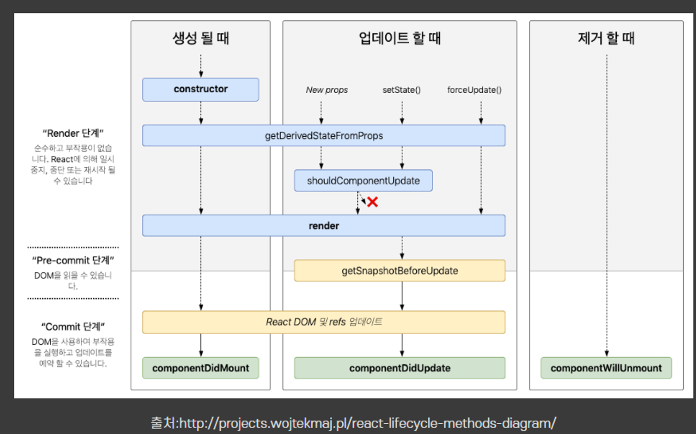

# useEffect -1 기초

<aside>
🥝 컴포넌트가 **렌더링 될 때마다** 특정 작업(side effect)을 실행할 수 있도록 함.

</aside>

> side effect?
컴포넌트가 렌더링 된 **이후**에 **비동기**로 처리되어야 하는 부수적인 효과들.
> 

첫번째: 페이지가 처음 렌더링되고난 후 useEffect 무조건!!! 한번 실행됨.

두번째: useEffect에 배열로 지정한 useState 값이 변경되면 실행됨

### mount시, unmount시, update시 특정 작업을 처리할 수 있음.

즉, 클래스형 컴포넌트에서 사용할 수 있었던 생명주기 메소드를 함수형 컴포넌트에서도 사용할 수 있게 된 것.

- component**Did**Mount : 컴포넌트를 만들고, 첫 렌더링을 다 마친 후 실행.
- component**Did**Update: 리렌더링을 완료한 후 실행. 즉, render()가 업데이트 될때마다 실행.
- component**Will**Unmount: 컴포넌트를 DOM에서 제거할 때 실행함.



## 사용 방법

---

```jsx
useEffect( function, deps )
```

- function : 수행하고자 하는 작업.
    - 리액트는 이 함수를 기억했다가 DOM 업데이트 후 불러낸다.
    - 이 함수에서 함수를 return 할 경우, (리턴된) 함수는 컴포넌트가 unmount 될 때 다시한번 실행된다 — 이거뭔말임?
- deps: 배열형태
    - 배열 안에는 검사하고자 하는 특정 값 or 빈 배열
    - deps에 특정 값을 넣으면,
        - 컴포넌트가 mount 될때,
        - 지정한 값이 **업데이트** 될 때 useEffect 를 실행한다.

**결론적으로는 컴포넌트가 마운트될 때, 의존 배열에 넣은 값이 바뀔 때 function이 실행된다는 거임.**

## 사용 방식

---

### 1. 마운트됐을때 `componentDidMount`

- **빈 배열** 넣으면
    
    컴포넌트가 화면에 첫 **렌더링 될 때 == 마운트 될 때**  한번만 실행하고 싶다면 deps에 빈 배열을 넣는다.
    
- 배열을 **아예 안넣으면**
    
    렌더링, 리렌더링 될 때마다 실행됨
    

### 2. 업데이트 됐을 때 `componentDidUpdate`

- 특정 props, state가 바뀔때 실행 (useEffect 내부에 props, state 말하는거임)
- 배열에 넣은 값이 **업데이트** 될때 실행 + **마운트될때도** 실행됨.

```jsx
useEffect(() => {
	console.log(name)
	}, [name])
```

 이름 값이 바뀌면 실행됨. 

- 만약에 마운트 될때는 실행 안하고 업데이트 될 때만 실행하고 싶으면

```jsx
const mounted = useRef(false);
useEffect(() => {
	if (!mounted.current) {
		mounted.current = true;
	**} else {
		console.log(name)
	}
}, [name]);
```

- useRef 사용해서
    - 초기값 false로 주고
    - false일때는 true로 바꾸고 (즉, 처음 마운트되어 실행된다면 이거만 실행되는 거임)
    - true 일때만 (마운트 된 이후) + name이 업데이트 되면, 원하는 함수가 실행되는 거임
- 라고 하는데 근데 useRef 사용하는게 맞음? useState와 useRef의 차이는 뭘까? 빨리 useRef도 공부해서 이해하자.

### 3. 언마운트시 실행 `componentWillUnmount`

unmount 될때 (되기 직전) & update 되기 직전에 실행.

차근차근 봅시다

```jsx
useEffect(() => {
	console.log('effect')
	console.log(name);
	return () => {
		console.log('cleanup')
		console.log(name);
	};
}, []);
```

이렇게 하면..  cleanup 이라고 찍히는 함수 반환. ( return 뒤에 나오는 함수이며, useEffect에 대한 뒷정리 함수라고 함)

1. 언마운트될때만 cleanup 함수를 실행하고 싶으면 의존성에 **빈배열**
2. 특정 값이 업데이트 되기 직전에 cleanup 함수를 실행하고 싶다면, 그 값을 의존성에 넣음

<aside>
🥝 useEffect 함수가 실행되기 **전에** cleanup 함수가 실행됨.
(처음 실행되는 경우 제외)
cleanup 함수는 DOM에서 마운트 해제될때마다 실행됨.

</aside>

—> 즉, 컴포넌트가 **재사용될 때마다** 실행되며 모든 새로운 sideEffect 함수가 실행되기 **전에** (처음 실행 제외), 그리고 컴포넌트가 제거되기 직전에 실행됨

## deps에 특정 값 넣기

deps에 특정 값을 넣으면,

- 컴포넌트가 처음 마운트 될 때
- 지정한 값이 바뀔 때
- 언마운트될 때
- 값이 바뀌기 직전에

모두 호출이 된다….!!!

그래서 useEffect **안에서 사용하는 상태나, props**가 있다면 useEffect의 **deps에 넣어주어야 하는 것이 규칙**임.

만약 사용하는 값을 넣어주지 않는다면, useEffect 안의 함수가 실행될 때 최신 상태, props를 가리키지 않는다.

deps 파라미터를 생략한다면, 컴포넌트가 **리렌더링 될 때마다** useEffect 함수가 호출된다. 즉, 어떠한 작은 요소라도 변화한다면 계속 계속 실행된다.

## deps 배열에 따라 다시한번 정리하기

### 아무것도 안쓸때

- 렌더링 됐을때 1번 + 계속계속 실행된다고 보면 된다. 캐예민한상태. 뭐라도 작은거라도 바뀌면 계속 실행됨.

### 빈배열 쓸때

- 렌더링되고 딱한번만 실행된다.

### 뭐 넣었을때

- 렌더링 됐을때 1번 + 걔가 변했을때마다 실행됨.
- 규칙은 - useEffect 안에서 뭔가 props나 state의 변화가 있다면 의존성에 넣어줘야함. 안넣으면 그 아이들의 최신성을 보장할 수 없다.
- 뭐 여러개 넣으면 걔네들 중에 하나라도 변하면 실행됨 (or)

- 참고한 사이트
    
    [https://despiteallthat.tistory.com/182](https://despiteallthat.tistory.com/182)
    
    [https://ko-de-dev-green.tistory.com/18](https://ko-de-dev-green.tistory.com/18)
    
    [https://velog.io/@ksh4820/useEffect-의존성-배열-관리-방법](https://velog.io/@ksh4820/useEffect-%EC%9D%98%EC%A1%B4%EC%84%B1-%EB%B0%B0%EC%97%B4-%EA%B4%80%EB%A6%AC-%EB%B0%A9%EB%B2%95)
    
    → 이 글을 보니까 의존성 배열을 안쓰는 게 좋다고하는데.. 여기는 심화인거같아서 -2로 다시 정리해야할듯하다.